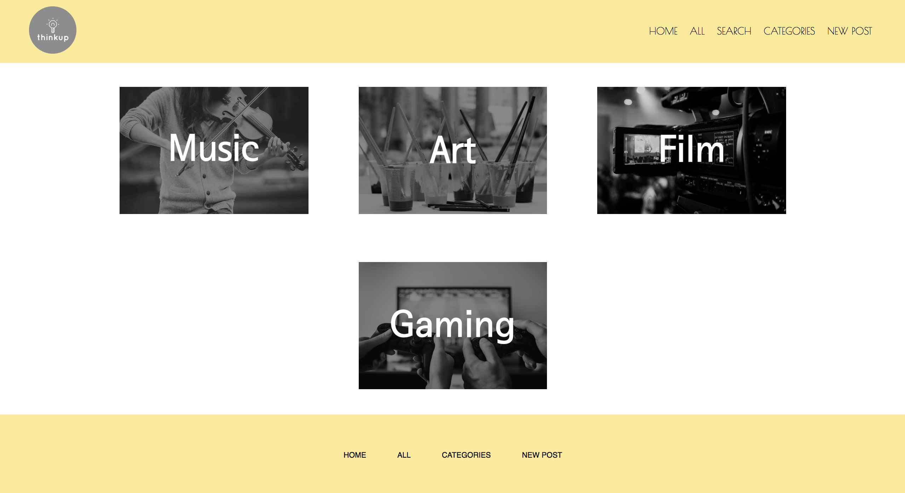
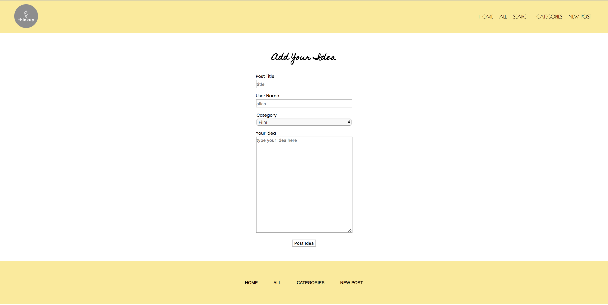

# Thinkup
Thinkup is a website to keep track of all ideas and inspiration of users. It allows to store any thoughts, feelings and even images and let users to revisit to see and use those ideas for their projects, arts, music and etc.

## Deployment
This is a link to our depolyed website using Heroku.  [Thinkup]

## Built With
**Languages:**
* React
* Redux
* CSS
* Express
* Node
* Cloudinary
* Axios

## Screenshoots

## Team members 
* [Jaehee Kim](https://github.com/jaeheekim051510)
* [Ellen Kramp](https://github.com/ellenkramp)

[thinkup]: https://app-thinkup.herokuapp.com/#/